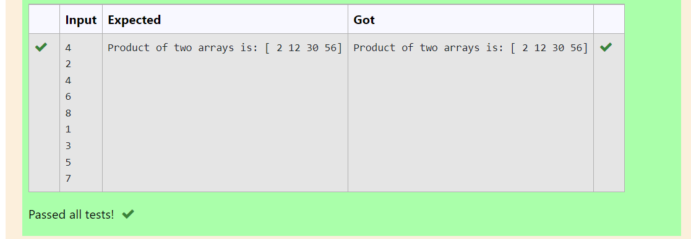

# Multiplying-two-matrix

## AIM:To write a program to perform multiplying two matrix using python programing. 

## ALGORITHM:

### Step 1:import numpy as np.
### Step 2:Declare a variable array1 as an empty list. 
### Step 3:Declare a variable array2 as an empty list. 
### Step 4:Get input values as n.
### Step 5:Iterate a variable i in range n by for loop and opened the values to the list array1 end the loop.
### Step 6:Iterate a variable i in range n by for loop and opened the values to the list array2 end the loop.
### Step 7:Declare a variable product to array and compute array1*array2.
### Step 8:Print the value of a product.

## PROGRAM: 
import numpy as np
l1,l2=[],[]
n=int(input())
for i in range(n):
    l1.append(int(input()))
for i in range(n):
    l2.append(int(input()))
array_1=np.array(l1)
array_2=np.array(l2)
product=array_1*array_2
print("Product of two arrays is:",product)
     

## OUTPUT:

## RESULT:
Thus the program is executed successfully.

